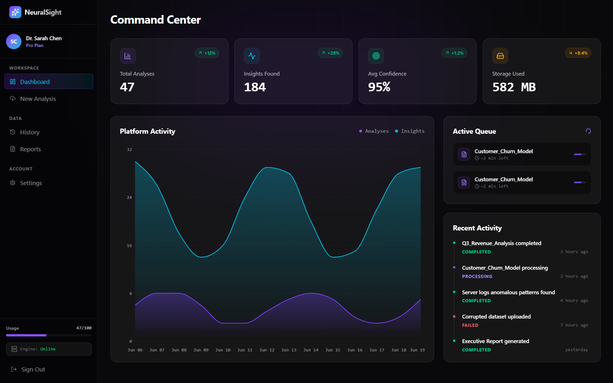
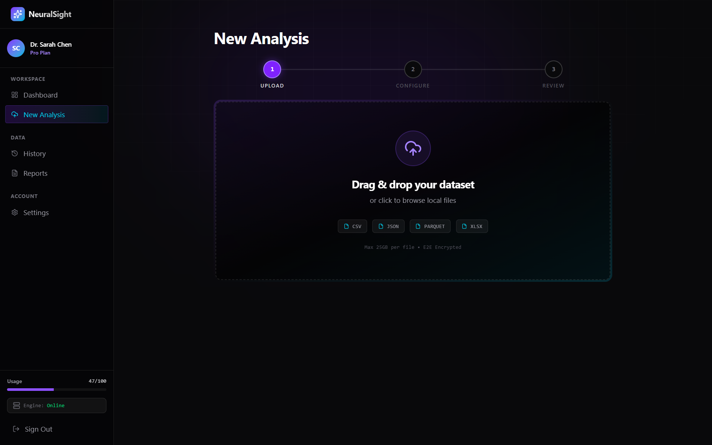
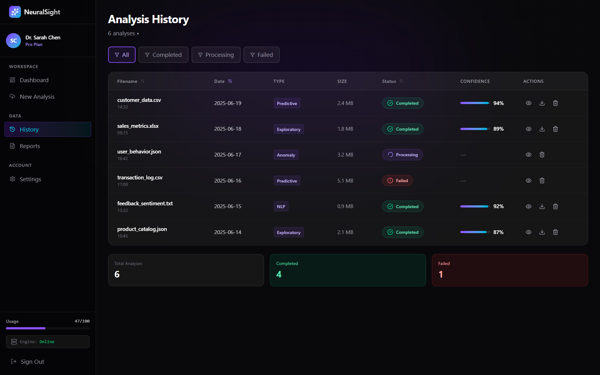
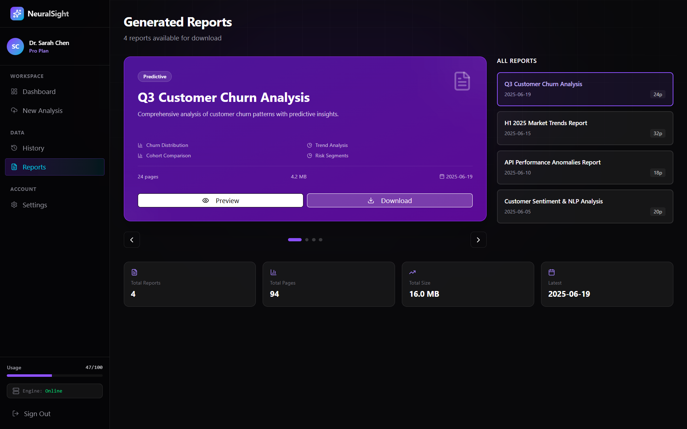
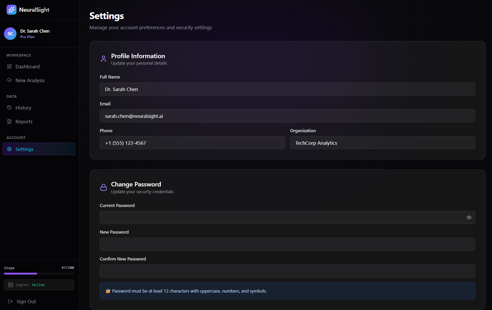
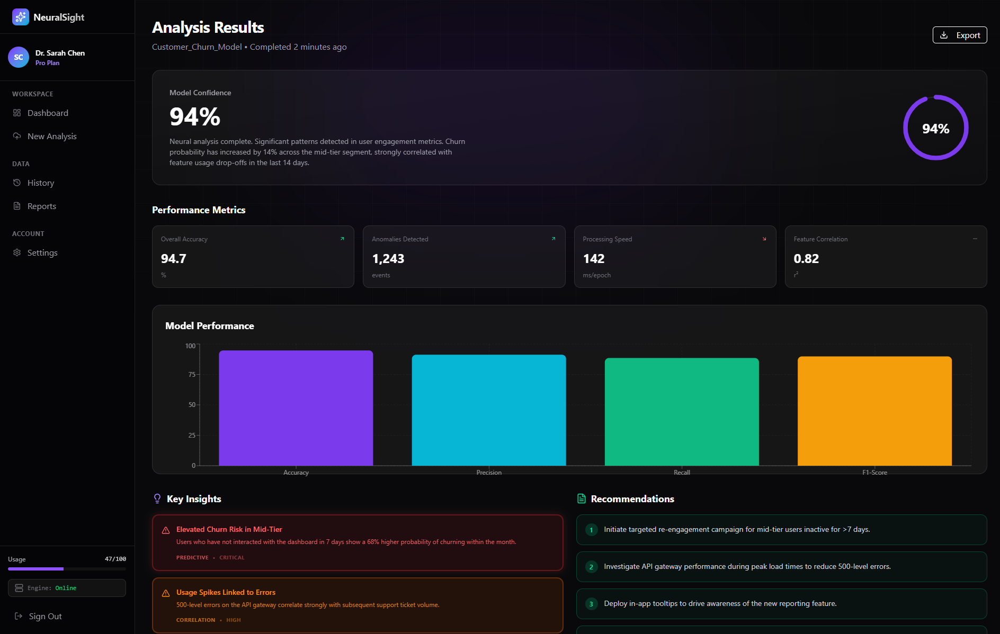

# AI-Run Hackathon Submission

## Project Overview
This repository contains the full AI candidate ranking system built for the Redrob hackathon.
It includes a ranking backend, feature extraction pipeline, trap detection logic, and a frontend UI prototype.

The primary submission flow is:
1. Extract features from `ui/ranking/data/candidates.jsonl`
2. Apply trap detection for honeypots, keyword stuffers, and duplicate profiles
3. Rank candidates with a rule-based score + semantic reranking
4. Generate `ui/ranking/outputs/submission.csv` in the required hackathon format

## Root Reproducibility Command
From the repository root, run:

```bash
python rank.py
```

This generates:
- `ui/ranking/outputs/top100.csv`
- `ui/ranking/outputs/submission.csv`

## Repository Structure
```
ui/
├── frontend/                # React frontend prototype and UI documentation
│   ├── README.md            # Frontend-specific documentation
│   ├── src/                 # Frontend source code
│   └── docs/screenshots/    # UI screenshots referenced by frontend README
├── ranking/                 # Ranking pipeline, preprocessing, traps, and output generation
│   ├── data/                # Input dataset and job description
│   ├── preprocessing/       # Feature extraction modules
│   ├── traps/               # Honeypot, duplicate, keyword stuffer detectors
│   ├── ranking/             # Scoring, selection, and submission generation
│   ├── generate_features.py  # Feature extraction runner
│   ├── rank.py              # (root-level entrypoint under ui/) Reproducible ranking command
│   └── README.md            # Ranking-specific documentation
├── README.md                # This project-level documentation
├── TODO.md                  # pending implementation checklist
└── submission_metadata.yaml # Hackathon submission metadata template
```

## What is included
- `rank.py` — root entrypoint for the ranking pipeline
- `requirements.txt` — Python runtime dependencies
- `frontend/` — front-end prototype and UI documentation
- `ranking/` — full ranking system, feature engineering, and output generation
- `submission_metadata.yaml` — submission metadata file to complete before final upload

## How to use
### Ranking submission generation
```bash
python rank.py
```

### Optional frontend dev flow
```bash
cd frontend
npm install
npm run dev
```

## Notes for final submission
- `submission.csv` must contain exactly 100 ranked rows plus header.
- Required columns in order: `candidate_id,rank,score,reasoning`.
- Scores must be non-increasing from rank 1 to rank 100.
- No external network calls should be made during ranking.
- The ranking step must run on CPU only and within the contest compute budget.

## Frontend documentation
The frontend has its own detailed README at `frontend/README.md`.
That file includes UI screenshots, page links, and component summaries.

## Screenshots
UI screenshots are embedded below from the `frontend/docs/screenshots/` folder.














## Cleanup status
- Generated build artifacts have been removed from source control.
- Large archive files have been deleted from the workspace.
- The repo now contains only source code, docs, and submission assets.

## Current status
- Ranking pipeline is implemented and runnable.
- Final submission validation is required before upload.
- `submission_metadata.yaml` still needs sandbox and methodology details.
